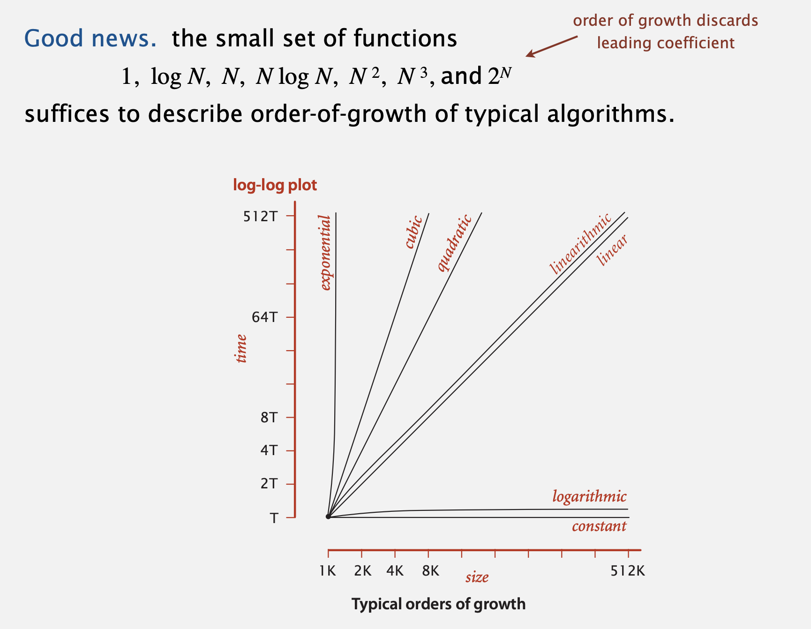
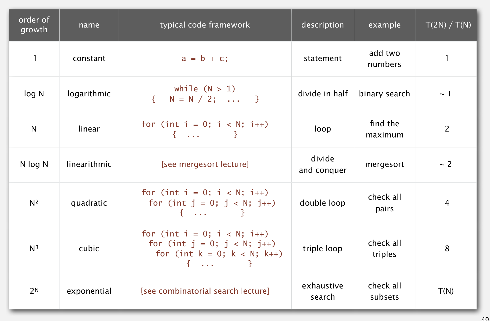

# Data structures and algorithms

## Analysis of Algorithms

### Running Time

#### Observations

Observe how running time increases when we double the input.

| N       | time |
| ------- | ---- |
| 250     | 0.0  |
| 500     | 0.0  |
| 1, 000  | 0.1  |
| 2, 000  | 0.8  |
| 4, 000  | 6.4  |
| 8, 000  | 51.1 |
| 16, 000 | ?    |

#### Mathematical Models

Total running time: sum of cost × frequency for all operations.

| operation               | example          | nanoseconds |
| ----------------------- | ---------------- | ----------- |
| integer add             | a + b            | 2.1         |
| integer multiply        | a \* b           | 2.4         |
| integer divide          | a / b            | 5.4         |
| floating-point add      | a + b            | 4.6         |
| floating-point multiply | a \* b           | 4.2         |
| floating-point divide   | a / b            | 13.5        |
| sine                    | Math.sin(theta)  | 91.3        |
| arctangent              | Math.atan2(y, x) | 129.0       |

#### Order-Of-Growth Clasifications

Typically, better order of growth ⇒ faster in practice.

#### Theory of Algorithms

**Best case**

- Lower bound on cost.
- Determined by “easiest” input.
- Provides a goal for all inputs.
- Big Omerga Notation `Ω(N2)`

**Worst case**

- Upper bound on cost.
- Determined by “most difficult” input.
- Provides a guarantee for all inputs.
- Big Oh Notation `O(N)`

**Average case**

- Expected cost for random input.
- Need a model for “random” input.
- Provides a way to predict performance.
- Big Theta Notation`Θ(N)`

### Memory Requirments
